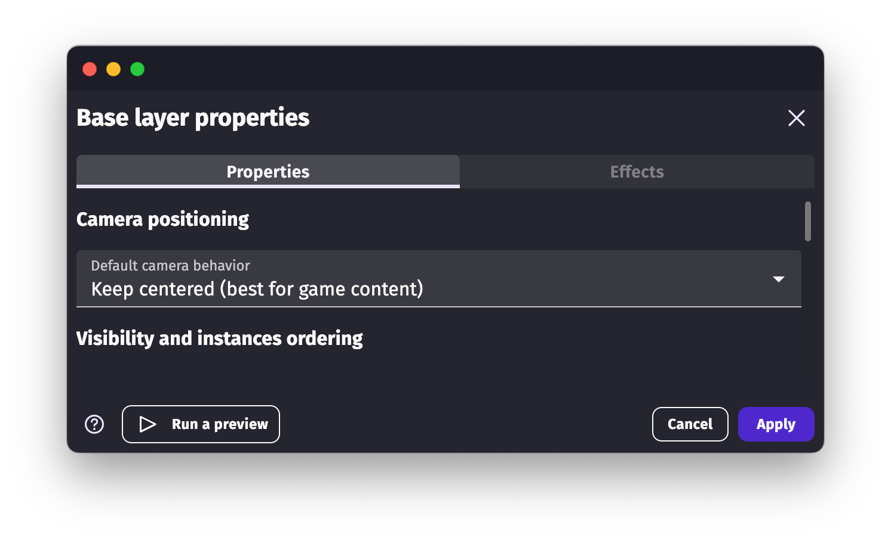

# Layers and cameras

## Layers

A layer is a virtual container of objects in a scene. Layers serve multiple purposes, including:

  *   Determine the position of objects in the scene
  *   Front-to-back ordering of object instances (similar to Z-order)
  *   Layers can be hidden, which affects all objects in the layer
   * Changing the time scale for all objects in a layer
   * Apply visual effects to all objects on the layer
   *   Each layer has a camera that can be moved, rotated, and zoomed

Each scene can have multiple layers, but objects can only exist on one layer at a time. By default, objects added to a scene will be placed on the "base layer".

If there are two or more layers, the objects on the lowest layer will always be displayed under the objects on higher layers, regardless of their Z-order.

!!! tip

    Think of layers as sheets of transparent paper that you put on top of each other.

To create a new layer or edit existing ones, open the layers panel using the **Layers panel** button on the toolbar:

In the layers editor, you can create a new layer by clicking the **Add new layer** button at the bottom of the panel. You can change the names of the layers and also toggle their visibility and add effects. You can reorder the layers by clicking and dragging the double bars on the left.

### Layer centering according to the game window

Edit a layer properties to access multiple options regarding a layer. You can notably choose if:

* The camera of the layer **stays centered** when the game window is resized. This is usually useful for game content or menus
* The **top-left corner of the camera stays fixed** when the game window is resized. This is usually useful for UI or content that can expand.

!!! note

   This camera behavior is only useful when you're not using events to move the camera. If you center a camera on an object for example, this option won't have any impact.

### Moving objects to a different layer

Objects can be dynamically moved to a different layer while the game is running.  There is a condition to check which layer an object is on, and an action that will change the layer of an object.

### Visibility of a layer

The visibility of a layer can be set to hidden or visible.  Layers are visible by default, but this can be changed in either the Layers panel or by using events. Hiding a layer _does not_ delete the objects on the layer. If a layer is hidden, all the objects on the layer exist and can interact with the objects on other layers, but they are not displayed on the screen.

### Time scale of objects in a layer

**Time scale** is the speed at which the game runs relative to the default speed, which is 1. This can be modified to slow down or speed up the game. Changing the time scale of a layer allows you to change the speed of everything happening in a single layer. To slow down the time on a layer, set the time scale to less than 1. To speed up the time on a layer, set the time scale to greater than 1.

### Effects (shaders) on layers

You can add [effects](/gdevelop5/interface/scene-editor/layer-effects) that change how a layer is rendered. This allows a user to quickly add things like a night effect, a flashback/retro atmosphere with sepia colors, etc... [Read more about effects here](/gdevelop5/interface/scene-editor/layer-effects).

## Cameras

While the game is running, each layer has its own virtual camera.  These cameras can be moved, rotated, and zoomed to change the part of the layer that is rendered on the screen.

!!! tip

    To move a camera smoothly, use the camera tween actions, which are perfect for transitions and cutscenes.  There are also several extensions that help with camera management.

### Centering the camera on an object

There are two actions to position the camera on an object:

* If you want an object to always stay in the view of the camera, you can use the action **Center the camera on an object**. This will make the camera follow the object wherever it goes in the scene.

* To prevent the camera from going out of bounds, you can use the action **Center the camera on an object within limits**. This will let the camera follow the object while preventing the center of the camera from leaving the boundaries described in the action.

### Zooming with the camera

Cameras can have a level of zoom applied to them. If you zoom into a scene, the contents appear larger and if you zoom out, they appear smaller than the default setting. The default zoom value is 1. To zoom in, set a value higher than 1 and to zoom out, set a value less than 1.

### Dimensions and angle of the camera

Camera height is the vertical size of the visible game and camera width is the horizontal size. There are conditions to compare these values, or you can use the expressions **CameraHeight()** and **CameraWidth()**.

Camera angle controls the camera rotation.  Similar to objects, the default angle is 0 and increases in the clockwise direction.  There is a condition to check the camera angle, or you can use the expression **CameraAngle()**.

### Enforce camera boundaries

Many games use a moving camera but they also must prevent the camera from displaying an area outside the game's boundaries.  This can be accomplished by using the **Enforce camera boundaries** action after all other camera movement actions.

There are also several [useful expressions](https://wiki.gdevelop.io/gdevelop5/all-features/camera/reference#expressions) that provide the current boundaries of the camera:

- CameraBorderTop(layer, number)
- CameraBorderBottom(layer, number)
- CameraBorderLeft(layer, number)
- CameraBorderRight(layer, number)

## Reference

All actions, conditions and expressions are listed in [layers and cameras reference page](/gdevelop5/all-features/layers-and-cameras/reference/).