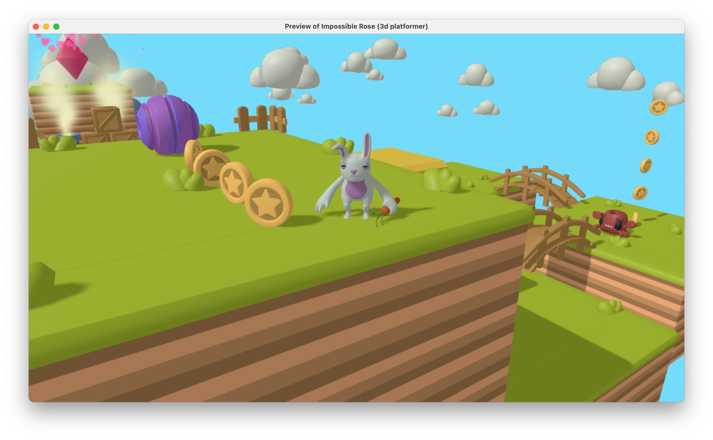

# 3D model

A 3D model displays an object modeled in a 3D modeling software, with one or more animations. Like a [sprite for 2D games](../sprite) (or for interfaces in 3D games), it's a very common object that can be used for players, enemies, backgrounds, projectiles.

If you need to create walls, plane grounds or other rectangular/cubic 3D objects, consider using the [3D box object](../3d-box).

## Lighting

Lighting can be set up through [layers effects](../../interface/scene-editor/layer-effects). Ambient and directional light effects allow to configure basic lighting for 3D layers.

The model can be set up to react to lighting in different ways. The GLTF format can include data about light reflection. The 3D model can either use this data or use a forced configuration.

## Shadows

3D models can cast and receive shadows. To display shadows:

- Ensure the layer has a **Directional Light** effect. New layers in new games include this effect along with an Ambient Light by default.
- Set the object's material to **Standard** (not **Basic**, which ignores lighting).
- Enable **Shadow casting** and **Shadow receiving** in the object's properties (enabled by default for new assets from the store).

Shadows are computed around the camera with a range suitable for most games. You can adjust the light intensity, shadow quality and range by editing the Directional Light effect in the layer's effects.

## File format

GDevelop supports 3D models saved in the **GLB (.glb) format**. It is a standardized file format used to share 3D data. Notably, it includes the 3D mesh of the object, as well as its textures or material specifications. This format is also sometimes called **GLTF**, for "GL Transmission Format". You can sometimes find .gltf files, but only the **.glb** files are supported by GDevelop, as they can embed the textures whereas .gltf files can't do this.

## Performance considerations

Large 3D models can impact your game as they will have:

- A larger size, making your game bigger and slower to download (especially on mobile phones or without broadband),
- A larger impact on the loading time (which will be slower, especially on low end devices),
- A negative impact on game performance, as the player device graphics card will need to spend more time rendering all the triangles composing the 3D model.

!!! tip

    We recommend you start building a game using *"low-poly"* 3D models.

## How to find or create 3D models?

!!! tip

    The GDevelop asset store will soon contain 3D models, so that it will be faster and easier to build your games. If you want to sell your assets (2D images, 3D models, audio or ready-to-use objects/extensions), [read more here](../../community/sell-asset-pack-store).

This section will be enhanced with various solutions to build your 3D models.

You can find free or premium 3D models suitable for your games on some website like:

- [Kenney.nl](https://www.kenney.nl/assets/category:3D).
- [Quaternius.com](https://quaternius.com/index.html).
